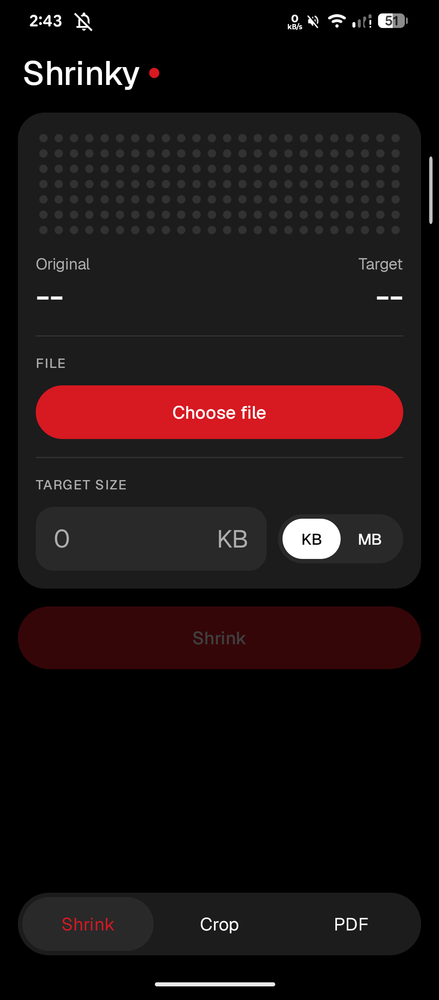
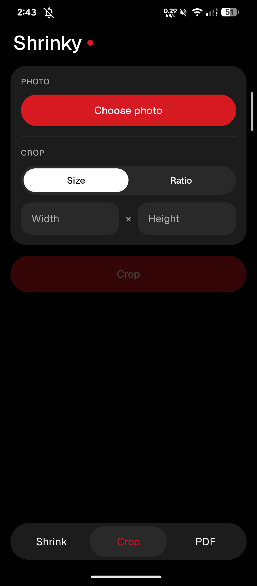
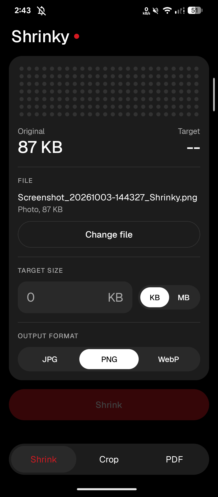
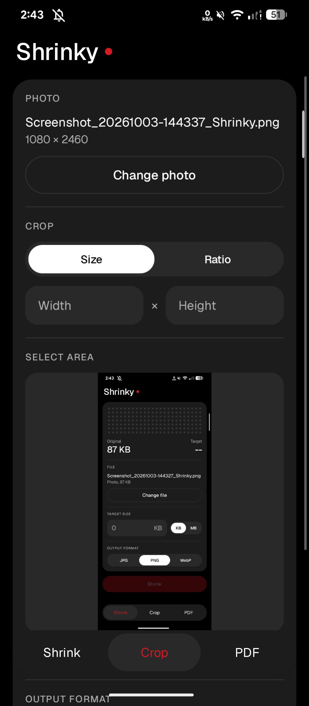
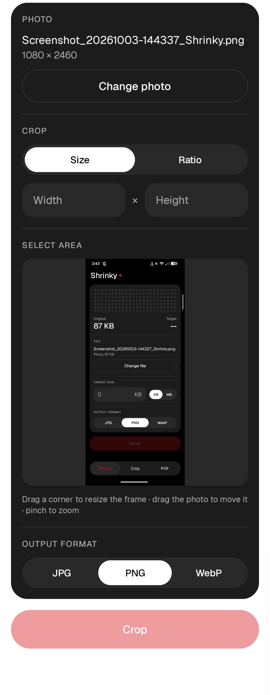
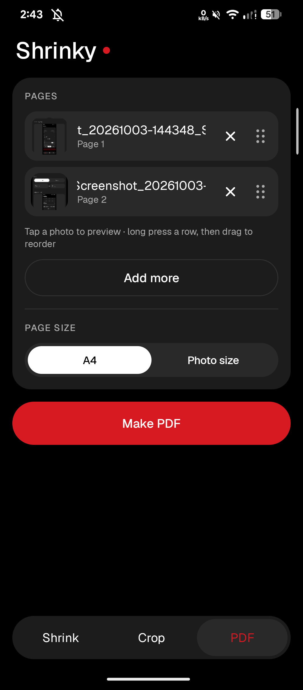

# ⚡ Shrinky

A featherlight, distraction-free utility designed to compress, crop, and convert images, videos and PDFs without breaking a sweat. Built with a sleek design language inspired by Google Pixel’s Material You and Nothing OS minimalism.

> ⚠️ **Disclaimer:** This app is 100% **vibe-coded**, and yes, this `README.md` was also written by an AI. Built fast, built light, and fueled entirely by vibes.

---

## 🌟 Highlights

- 🪶 **Under 2 MB** — Ultra-lightweight footprint. No bloatware, zero trackers, and zero unnecessary runtime dependencies.
- 📉 **Intelligent Image Compression** — Shrink high-res photos down to your exact target size without turning them into pixelated mush.
- ✂️ **Precision Cropping** — Crop to custom width/height dimensions or standard aspect ratios (1:1, 4:5, 16:9, etc.) with instant previews.
- 📄 **Image to PDF Converter** — Convert single or multiple images directly into clean, standardized PDF documents.
- 🎞️ **Video Compression** — Shrink videos to a target size on-device. Pick the video codec (H.264, H.265, AV1, VP9 — whatever your phone supports) and audio (original, AAC, Opus, mute). Resolution is picked automatically or capped at 1080p/720p/480p. Runs in the background with a progress notification.
- 🎧 **Audio Compression** — Shrink audio files to a target size, or convert them: AAC (m4a), Opus, FLAC (lossless) and WAV, with mono/stereo control. Low sizes automatically use HE-AAC where the phone supports it.
- 📑 **PDF Compression** — Compress heavy PDF files right on your device for fast email attachments and uploads.
- 🎨 **Pixel × Nothing UI Aesthetic** — Monochromatic accents, clean typography, dot-matrix vibes, and intuitive fluid interactions.
- 🔒 **100% Offline & Private** — All processing happens locally on your hardware. Your files never touch a remote server.

---

## 🛠️ Feature Breakdown

### 1. Media Compression
* **Custom Target Size:** Define exact target file thresholds (KB/MB).
* **Quality Slider:** Fine-tune the balance between bitrate and visual fidelity.
* **Format Flexibility:** Works across standard raster formats (PNG, JPG, WebP).

### 2. Dimension & Ratio Cropping
* **Freeform Adjustments:** Specify exact pixel dimensions ($W \times H$).
* **Preset Aspect Ratios:** Quick toggles for profile pictures, social posts, and landscape shots.

### 3. PDF Suite
* **Batch to PDF:** Merge several photos into a single PDF document in seconds.
* **PDF Size Reducer:** Downsample embedded assets and optimize document structure to strip out wasted megabytes.

---

## 🚀 Getting Started

### Installation
1. Head over to the [Releases](https://github.com/yourusername/shrinky/releases) tab.
2. Download the latest `Shrinky.apk` (under 2 MB).
3. Install and run directly on your Android device.

---

## Credits
 The UI typeface is [Geist](https://github.com/vercel/geist-font) by Vercel, under the SIL Open Font License 1.1.

## screenshots 

  
  
  

  
  
  

